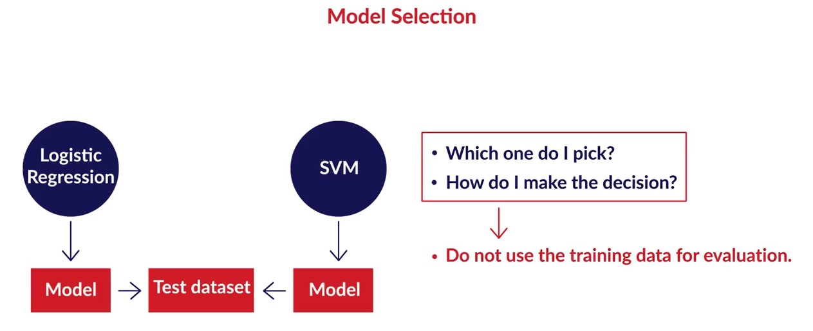
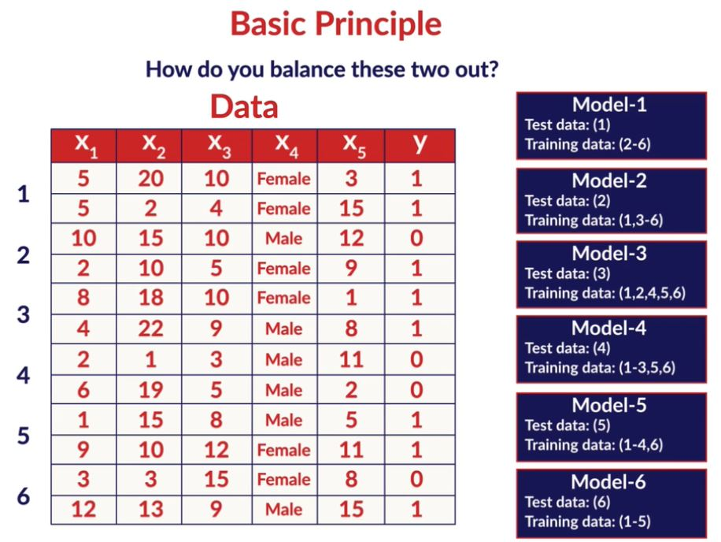

# Model Selection

## Introduction
In the following sessions, we will learn concepts and principles which are central to all of machine learning. In this session, we will build a conceptual foundation which will likely be useful in almost every machine learning problem we will solve in the future. 

After this module, we should be able to apply some fundamental principles to choose appropriate models and critically evaluate the pros and cons of each model. The topics and some important jargons in this session include:

* Occam’s Razor 
* Overfitting
* Regularization
* Bias-Variance Tradeoff
* Model Complexity

## Principles of Model Selection
In the previous course, you may have come across situations where a model performs well on training data but not on the test data. Also, you would have faced confusion about which model to use to a given problem. For example, by now you have learned many classification models. Given a problem that requires classification, how would you decide about the best one to go with?

Questions like these frequently arise irrespective of the choice of model, data or the problem itself. The aim of this session is to answer questions like these.

In these sessions you will be learning some thumb rules and some general pointers about how to go about selecting the appropriate models. This session is just a discussion on such thumb rules. In the subsequent sessions, you will see these rules being applied in the context of various problems and algorithms. The central issue in all of the machine learning is “how do we extrapolate learnings from a finite amount of available data to all possible inputs ‘of the same kind’?” Training data is always finite, yet the model is supposed to learn everything about the task at hand from it and perform well on unseen data.

Take the car pricing dataset in linear regression, for example, which was trained using a few thousand observations. How do you ensure, and be confident, that the model is as good as it seems on the training data and deploy it to make predictions on real, unseen data?

Often, it is mistaken that if a model performs well on the training data, it will produce good results on test data as well. Very often, that is not the case.

**Occam's razor** is perhaps the most important thumb rule in machine learning, and incredibly 'simple' at the same time. **When in dilemma, choose the simpler model.** The question then is 'how do we define simplicity?'. In the next segment, you will study some objective ways to measure model simplicity and understand why simplicity is preferred over sophistication and complexity using various examples.

## Model and Learning Algorithm
Before you dive into what exactly a simple model is, what all its benefits are, we will take a short detour to reiterate some terminologies and the machine learning framework. You will now understand the process of using training data, learning from it and then building a model to describe a system which performs a task at hand, like classification or regression. The key objectives here are to understand:
* The meaning of model, learning algorithm, system and hypothesis class
* The (often misunderstood) difference between a learning algorithm and a model
* The meaning of ‘class of models’ 

Learning algorithm's task is to figure out what needs to be done, how it needs to be done and returns a model. In linear regression, for example, the learning algorithm optimises the cost function and produces the models, i.e. the coefficients.

You just revised the basic machine learning framework. You will now learn a basic property of a learning algorithm - that it can only produce models of a certain kind within its boundaries. This means that an algorithm designed to produce linear class of models, like linear / logistic regression, will never be able to produce a decision tree or a neural network. The class of model becomes critical because a wrong class will yield a sub-optimal model.

Every learning algorithm puts a boundary around the kinds of models that it is going to ever consider and among those models, it will try to find the best which fits the data that it has been given for training. That model will come out as a output from the learning algorithm. Once you have this model then we can use it to make predicitions.

## Simplicity, Complexity and Overfitting
We will now discuss the notion of model simplicity and complexity in detail and use some examples and analogies to understand the pros and cons of simple and complex models.

Now let's see what kind of learning model to choose, if we choose regression then what kind of regression we are going to use?

From your school or college, you can probably recall those few fellows who seemed to study less but understood much more than others. They seem to never care about memorizing or mechanically practicing what was being taught, yet are able to explain complex problems in physics or mathematics with simplicity and elegance. 

Assuming that people learn using ‘mental models’, do these students have remarkably different mental models than those who solve a bunch of books and focus on memorization? How can they learn so much from a finite amount of information and apply that to solve unseen, complex problems? 

In this segment, we will explain the meaning of model simplicity, complexity as well as the pros and cons associated with them. As a by-product, you will also understand that the best way to ‘learn’ is ‘to keep your mental models simple’. 

Finally, you learned 4 unique points about using a simpler model where ever possible:

1. A simpler model is usually more generic than a complex model. This becomes important because generic models are bound to perform better on unseen datasets.
2. A simpler model requires less training data points. This becomes extremely important because in many cases one has to work with limited data points.
3. A simple model is more robust and does not change significantly if the training data points undergo small changes.
4. A simple model may make more errors in the training phase but it is bound to outperform complex models when it sees new data. This happens because of overfitting.

### Overfitting
Overfitting is a phenomenon where a model becomes too specific to the data it is trained on and fails to generalise to other unseen data points in the larger domain. A model that has become too specific to a training dataset has actually ‘learnt’ not just the hidden patterns in the data but also the noise and the inconsistencies in the data. In a typical case of overfitting, the model performs very well on the training data but fails miserably on the test data. 

## Bias-Variance Tradeoff
So far, we have discussed the pros and cons of simple and complex models. On one hand, simplicity is generalizable and robust and on the other hand, some problems are inherently complex in nature. There is a trade-off between the two, which is known as the bias-variance tradeoff in machine learning. You will learn about this topic in more detail in the modules to come. 

### Bias and Variance
We considered the example of a model memorizing the entire training dataset. If you change the dataset a little, this model will need to change drastically. The model is, therefore, **unstable and sensitive to changes in training data**, and this is called **high variance**.

The ‘variance’ of a model is the **variance in its output** on some test data with respect to the changes in the training data. In other words, variance here refers to the **degree of changes in the model itself** with respect to changes in training data.

**Bias** quantifies how accurate the model is likely to be on future (test) data. Extremely simple models are likely to fail in predicting complex real world phenomena. Simplicity has its own disadvantages.

Imagine solving digital image processing problems using simple linear regression when much more complex models like neural networks are typically successful in these problems. We say that the linear model has a high bias since it is way too simple to be able to learn the complexity involved in the task.

In an ideal case, we want to reduce both the bias and the variance, because the expected total error of a model is the sum of the errors in bias and the variance, as shown in the figure below.

Although, in practice, we often cannot have a low bias and low variance model. As the model complexity goes up, the bias reduces while the variance increases, hence the trade-off.

### Regularization
Having established that we need to find the right balance between model bias and variance, or simplicity and complexity, we need tools which can reduce or increase the complexity. In this segment, we will learn regularization methods which are used to keep an eye on model complexity.

Regularization is the process of deliberately simplifying models to achieve the correct balance between keeping the model simple and yet not too naive. Recall that there are a few objective ways of measuring simplicity - choice of simpler functions, lesser number of model parameters, using lower degree polynomials, etc.

## Model Evaluation

### Regularization and Hyperparameters
**Regularization** discourages the model from becoming too complex even if the model explains the (training) observations better. In the last session, you were introduced to this term which is used to find the optimal point between extreme complexity and simplicity. In this context, we will now discuss the use of hyperparameters of a model.

**Hyperparameters** are parameters that we pass on to the learning algorithm to control the complexity of the final model. Hyper parameter are choices that the algorithm designer makes to ‘tune’ the behavior of the learning algorithm. The choice of hyperparameters, therefore, has a lot of bearing on the final model produced by the learning algorithm.

Hyperparameters are a part of most learning algorithms which are used for training and regularization. In linear regression, as you will now see, the hyperparameter is used to regularize the model so that it does not become more complex than it should be.

Validation data is used for tuning the hyperparameters. So algorithms gets the hyperperameters generates the model using the training data and checks the validity of the model on the validation data. The test data is kept completely away holding it out. The algorithm can revisit the validation data any no. of times trying to fine tune the hyperparameters till it is happy with the model that it has produced. Once the final model is produced we just test the model on the test data.

To summarize the concept of hyperparameters:
* Hyperparameters are used to 'fine-tune' or regularize the model so as to keep it optimally complex
* The learning algorithm is given the hyperparameters as an 'input' and returns the model parameters as the output
* Hyperparameters are not a part of the final model output 

## Model Evaluation and Cross Validation
We now shift our attention towards model evaluation. The key thing to remember is that a model should never be evaluated on data it has already seen before. With that in mind, you will have either one of two cases - 
1. The training data is abundant 
2. The training data is limited.

The first case is straightforward because you can use as many observations as you like to both train and test the model. In the second case, however, you will need to find some ‘hack’ so that the model can be evaluated on unseen data and at the same time doesn’t eat up the data available for training. This hack is called **cross-validation**. 

## Model Evaluation: Python Demonstration-I
In the last few segments, you learnt about regularization and hyperparameters. You also learnt about cross-validation. In the next few segments, you will learn how to carry out hyperparameter tuning and cross-validation in python.

For demonstration, you will be using **cross-validation with linear regression** and then you will **tune the hyperparameter** for linear regression model. The hyperparameter for the linear regression model is the number of features that is being used for training.

For this demonstration, you will use the **housing.csv** file that was used in the linear regression module.

You may download the data and the python notebook from below.

[Model Evaluation in Python](dataset/Cross-Validation-LinearRegression.ipynb)

## Model Evaluation: Python Demonstration-II
In the last segment, you performed pre-processing on the housing dataset.Apart from using a straight line, you can also fit a polynomial to the training data with just one input variable. Fitting a polynomial to the data is known as polynomial regression. Let's first see how do you perform polynomial regression on the training data.

For linear regression of degree 1, you fit the curve of the form:

For polynomial regression of degree n, you fit the curve of the form:

In this way, instead of just fitting a straight line to a single input-feature dataset, you can fit a more complex curve to the training data.

How does fitting a more complex curve effect the accuracy on the test set? As you know, this can result in overfitting which can lead to low test accuracy.

Recall that you populated the following matrix with the outputs obtained by the linear regression models of various polynomical degrees.

The above matrix was then used to plot the graphs for test and train data.

In the graphs shown above, the blue points represent the train and test data points respectively - train on left-side and test on the right-side. The predictions for various polynomial degrees are shown in different colours. From the plots above, you can see the curves start to overfit the data as the degree of the polynomial is increased beyond a certain degree. This is confirmed by the value of R-squared for both test and train data:

As you can observe, the training score is increasing, while the test score is going down as the degree of the polynomial is increased. This is a clear sign of overfitting.

## Cross-Validation: Motivation
In this segment, you will learn about cross-validation. You will use this technique to select the **number of features** for a linear regression model.
As you already know, RFE is one such technique. Let's now see how you can use cross-validation to tune this hyperparameter.

The number of input variables in a linear regression model is a hyperparameter. RFE can be used to select this number. The process of selecting an optimal number is a tough task. Why? If the number of features is very large, say 150, it becomes impossible to do it manually.

In such a case, you have an option to automate it using cross-validation. Let's see how.

To summarise, the problems with manual hyperparameter tuning are:

* Split into train and test sets: Tuning a hyperparameter makes the model 'see' the test data. Also, the results are dependent on the specific train-test split.
* Split into train, validation, test sets: The validation data would eat into the training set.

However, in cross-validation, you split the data into train and test sets and train multiple models by sampling the train set. Finally, you just use the test set to test the hyperparameter once.

### Cross-Validation: Python Demonstration
In the last segment, you understood the need for using cross-validation for hyperparameter tuning. Let's now implement it in python.
pecifically, you will do k-fold cross-validation, wherein you divide the training data into k-folds.

Refer to the below image:

In **K-fold CV**, you divide the training data into K-groups of samples. If K=4 (say), you use K-1 folds to build the model and test the model on Kth fold. 

### Cross-Validation: Hyperparameter Tuning
Hyperparameter tuning is one of the essential tasks in the model building process. For a model to perform best on the data, you need to tune the hyperparameter(s). For linear regression, the number of features is a hyperparameter which you can optimise.

You use GridsearchCV to tune the hyperparameter(s) in python. The grid is a matrix which is populated on each iteration. Please refer to the image below.

You train the model using a different value of the hyperparameter each time. The estimated score is then populated in the grid.

There are broadly three steps you perform while tuning the hyperparameter(s) in python:
1. Create a cross-validation scheme: how many splits you want to set etc.
2. Specify the range of hyperparameters to tune.
3. Perform grid search on the set range.

The results for grid search can be seen using the following code:

You can use the plot of mean test and train score to choose the optimal number for the hyperparameter.

In the example above, you had to select only 13 features. What happens if you want to deal with a large number of features? In the next lecture, let's see how do you do it using the grid search cv method.

The cross-validation scheme used for this demonstration was K-fold, but this is not the only one which is used. There are multiple other schemes that can be used.

The various types of cross-validation are -

* K-fold cross-validation
* Leave one out(LOO)
* Leave P-out(LPO)
* Stratified K-Fold

For more information on the above methods, please go through the documentation https://scikit-learn.org/stable/modules/cross_validation.html